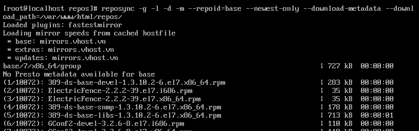

#  CÀI ĐẶT REPO TRÊN CENTOS

Trong một hệ thống nội bộ, việc cài thêm những gói package với các phần mềm, công cụ để hỗ trợ trong việc làm cụ thể của một Công ty thường xuyên xảy ra. Để đồng bộ các máy tính làm việc, ta cần có một hệ thống đã setup những packet của các phần mềm, công cụ cần thiết. Việc này giúp cho các máy tính có thể download cái phần mềm, công cụ trong mạng nội bộ, đạt được tốc độ cao hơn so với kết nối ngoài, giúp cho những người không biết gì về việc download các phần mềm, công cụ open-source.

# 1. Chuẩn bị

1. **Máy 1 dùng để làm webserver:** 
- Hệ điều hành: CentOS (version nào cũng được)
- Địa chỉ IP: 192.168.111.
- Đã được cấu hình Web Server Apache (Nginx), tham khảo tại <a href='https://blog.vietnix.vn/zero2hero-5-cai-dat-va-cau-hinh-web-server-apache.html'>đây</a>
  
2. **Máy 2 dùng để làm Cilent: được dùng để kiểm tra và download thử repo của server**
- Hệ điều hành: CentOS (version bất kì)
- Địa chỉ IP: 192.168.111.110

# 2. Cài đặt

1. **Cài đặt trên máy chủ:**

- Cài đặt phần mềm để tạo một vùng lưu trữ repomd từ rpms.
`$ yum install createrepo` 

- Cài đặt công cụ để thao tác `repo` và quản lí packet mở rộng
`$ yum install yum-utils`

- Tạo thư mục `repo` trong `/var/www/html/` bao gồm các thư mục con: base, centosplus, extras, updates
`$ sudo mkdir –p /var/www/html/repos/{base,centosplus,extras,updates}`


- Tiếp theo mình sync các repo cơ bản về
`$ sudo reposync -g -l -d -m --repoid=base --newest-only --download-metadata --download_path=/var/www/html/repos/`
* `-g` xóa package nếu như xác nhận GPG thất bại sau khi download
* `-l` bật hỗ trợ yum pugin
* `-d` xóa local packet mà không còn lưu trữ trong repo
* `-m` download cả tập tin comps.xml

    

- Tương tự với centosplus, extras, update
    ```
    $ sudo reposync -g -l -d -m --repoid=centosplus --newest-only --download-metadata --download_path=/var/www/html/repos/
    $ sudo reposync -g -l -d -m --repoid=extras --newest-only --download-metadata --download_path=/var/www/html/repos/
    $ sudo reposync -g -l -d -m --repoid=updates --newest-only --download-metadata --download_path=/var/www/html/repos/  
    ``` 

- Sau khi chờ download xong hết, thực thi lệnh
`$ sudo createrepo /var/www/html`

- Restart lại webserver
`$ service httpd restart`
- Lên web kiểm tra thử `http://192.168.111.111/repos`
    

2. **Cài đặt trên Client:**

- Tạo một tập tin .repo
`$ sudo nano /etc/yum.repo.d/local.repo`

- Thêm những dòng sau đây:

    ```
    [Vietnix.vn]
    name=mirror.vietnix.vn
    baseurl=http://192.168.111.111
    enabled=1
    gpgcheck=0
    ```
- Để kiểm tra hoạt động, ta cần bỏ hết .repo hiện đang có
`$ sudo rm /etc/yum.repo.d/*.repo`

    
- Kiểm tra thử cài đặt

# CÀI ĐẶT REPO CHO TẤT CẢ LINUX

- Không như ở mục trên bạn chỉ có thể làm cho hệ điều hành CentOS, ở phần này bạn có thể làm cho tất cả các bản của Linux (CentOS, Ubuntu, Fedora, Debian)
- Ở mục này mình đã có sẵn 1 con webserver với tên miền là http://mirror.vietnix.vn

1. **Cài đặt trên Server**

- Đồng bộ các bản `repo`, ở đây mình để 4 bản Linux có thể coi là phổ biến nhất, và mình sẽ làm demo về CentOS & Ubuntu

    ```
    # Cent OS
    rsync -aqzH rsync://mirror.aktkn.sg/centos/ /var/www/html/centos

    # Ubuntu (Optional)
    rsync -aqzH rsync://vn.archive.ubuntu.com/ubuntu/ /var/www/html/ubuntu

    # Fedora (Optional)
    rsync -aqzH rsync://download.nus.edu.sg/epel/ /var/www/html/fedora

    # Debian (Optional)
    rsync -aqzH rsync://ftp.hk.debian.org/debian/ /var/www/html/debian
    ```
    - `-r`: chế độ lưu trữ
    - `-q`: ngăn chặn cái thông báo không bị lỗi
    - `-z`: nén dữ liệu tệp trong quá trình truyền
    - `-H`: cho phép giữ các hard link 
    - **Optional:**
      - `--delete`: đồng bộ với thư mục chứa các repo (sẽ xóa luôn các thư mục khác với thư mục đang đồng bộ)
      - `--ignore-existing`: loại bỏ kiểm tra thư mục được chọn khi đồng bộ (dùng trong khi mình thêm vào những gói tin từ bên ngoài vào)

    - Dùng `crontab` để đồng bộ mỗi ngày: `crontab -e`
    - `0 */4 * * * rsync --aqzH --delete <src rsync> <dest> # Đồng bộ mỗi 4h`

2. **Cài đặt trên Client**

    a. **CentOS**
   - Sửa file `/etc/yum.repo.d/CentOS-Base.repo`
        ```
            # CentOS-Base.repo
        #
        # The mirror system uses the connecting IP address of the client and the
        # update status of each mirror to pick mirrors that are updated to and
        # geographically close to the client.  You should use this for CentOS updates
        # unless you are manually picking other mirrors.
        #
        # If the mirrorlist= does not work for you, as a fall back you can try the 
        # remarked out baseurl= line instead.
        #
        #

        [base]
        name=CentOS-$releasever - Base
        #mirrorlist=http://mirrorlist.centos.org/?release=$releasever&arch=$basearch&repo=os&infra=$infra
        baseurl=http://mirror.vietnix.vn/centos/$releasever/os/$basearch/
        gpgcheck=1
        gpgkey=file:///etc/pki/rpm-gpg/RPM-GPG-KEY-CentOS-7

        #released updates 
        [updates]
        name=CentOS-$releasever - Updates
        #mirrorlist=http://mirrorlist.centos.org/?release=$releasever&arch=$basearch&repo=updates&infra=$infra
        baseurl=http://mirror.vietnix.vn/centos/$releasever/updates/$basearch/
        gpgcheck=1
        gpgkey=file:///etc/pki/rpm-gpg/RPM-GPG-KEY-CentOS-7

        #additional packages that may be useful
        [extras]
        name=CentOS-$releasever - Extras
        #mirrorlist=http://mirrorlist.centos.org/?release=$releasever&arch=$basearch&repo=extras&infra=$infra
        baseurl=http://mirror.vietnix.vn/centos/$releasever/extras/$basearch/
        gpgcheck=1
        gpgkey=file:///etc/pki/rpm-gpg/RPM-GPG-KEY-CentOS-7

        #additional packages that extend functionality of existing packages
        [centosplus]
        name=CentOS-$releasever - Plus
        #mirrorlist=http://mirrorlist.centos.org/?release=$releasever&arch=$basearch&repo=centosplus&infra=$infra
        baseurl=http://mirror.vietnix.vn/centos/$releasever/centosplus/$basearch/
        gpgcheck=1
        enabled=0
        gpgkey=file:///etc/pki/rpm-gpg/RPM-GPG-KEY-CentOS-7
        ```

    b. **Ubuntu:**
        `Sửa deb http://archive.ubuntu.com/ubuntu/ ... -> deb http://mirror.vietnĩx.vn/ubuntu/ ...`
# Hết
***Chúc các bạn thành công***


### Author
- Ngo Xuan Huy
- <a href='https://github.com/nightbarron/Report_Vietnix_LinuxBasic/blob/main/part10/part10.md'>Dang Le Hoang Tuan </a>